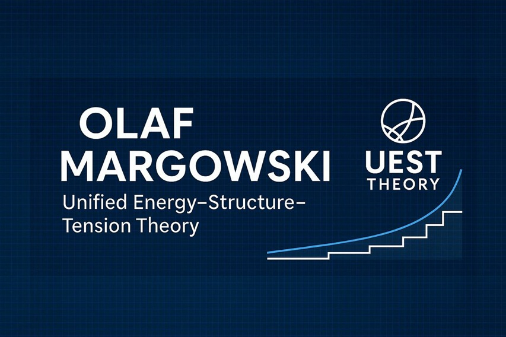
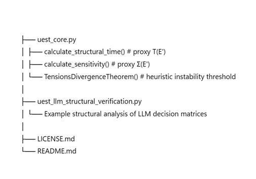

   

   
\# UEST Framework – Discrete Proxy Implementation  

\### Research Code Release (Non-Commercial)

\*\*Author:\*\* Olaf Margowski  

\*\*Year:\*\* 2025  

\*\*DOI (planned Zenodo deposit):\*\* \*to be assigned\*  

---

\## 🔬 What This Repository Contains

This repository provides the \*\*official discrete proxy implementation\*\* of structural  

metrics used in the \*\*Unified Energy–Structure–Tension (UEST) Framework\*\*.  

It includes:

\- `uest\_core.py`  

&nbsp; → Proxy versions of structural sensitivity Σ and emergent structural time T  

\- `uest\_llm\_structural\_verification.py`  

&nbsp; → Demonstration script for applying UEST-inspired metrics to LLM decision matrices  

These implementations \*\*do not\*\* represent the continuous mathematical definitions in the  

scientific UEST publications. They are simplified, finite-dimensional approximations intended  

for demonstration, analysis, and research.

---

\## 📘 Scientific Purpose

The UEST Framework introduces a \*\*universal structural comparison methodology\*\* for  

heterogeneous physical and mathematical systems, based on:

\- Structural Path: \\( S(E') \\)  

\- Structural Sensitivity: \\( \\Sigma(E') = |dS/dE'| \\)  

\- Emergent Structural Time: \\( T(E') = \\int\_0^{E'} \\Sigma \\, d\\xi \\)  

\- Template Classification (A / B / C)  

This repository provides proxy tools for exploring these ideas in:

\- Explainable AI  

\- LLM decision analysis  

\- stability diagnostics  

\- structural pattern verification  

---

\## 📄 Licensing \& Rights

This project is licensed under:

\### \*\*CC BY-NC-SA 4.0 + UEST Protective Clauses\*\*  

See `LICENSE.md` for the complete legal terms.

\### In summary:

\- \*\*Commercial use is strictly prohibited.\*\*  

\- \*\*AI/LLM commercial training is prohibited.\*\*  

\- \*\*UEST terminology cannot be used for product claims.\*\*  

\- \*\*Derivative patents require written permission.\*\*

---

\## 🧠 Citation

If you use this code for research or academic purposes, cite:

> Margowski, O. (2025). \*UEST Framework: Discrete Proxy Implementation.\*  

> Zenodo. DOI: \*to be assigned\*

---

\## 📂 File Overview

   

---

## ⚠️ Important Notes
- These tools **must not** be interpreted as the formal UEST analytical definitions.  
- They exist solely for **academic, non-commercial** exploration.  
- Industrial or product integration is **not permitted**.  

---

## 📨 Contact
For research collaboration or permissions:  
**Email:** weristnochda@gmail.com

